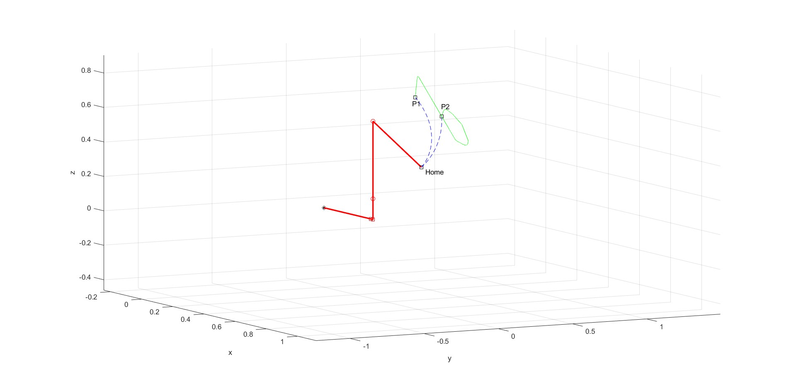
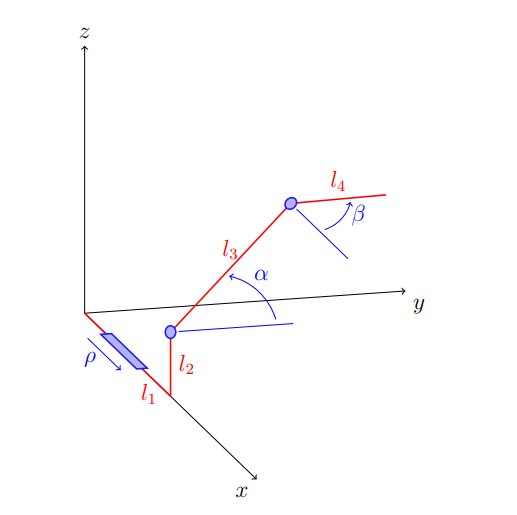
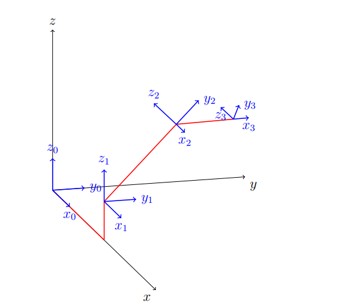
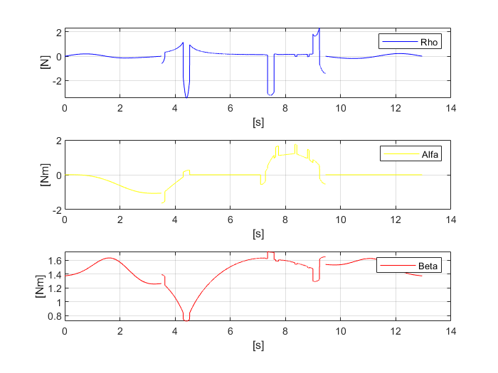
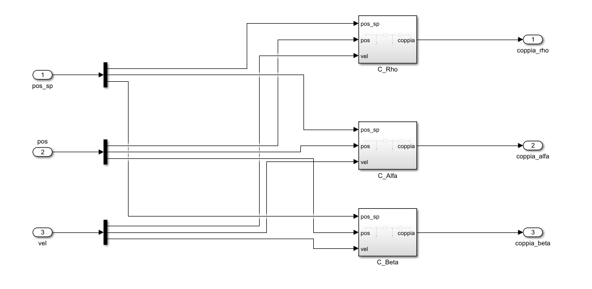
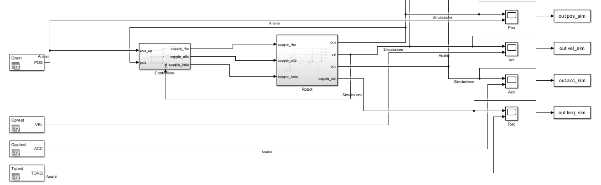
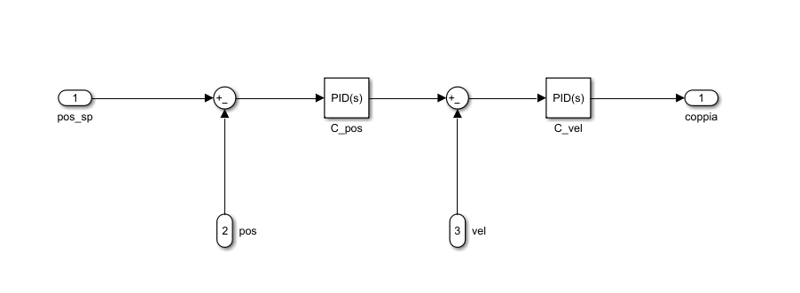
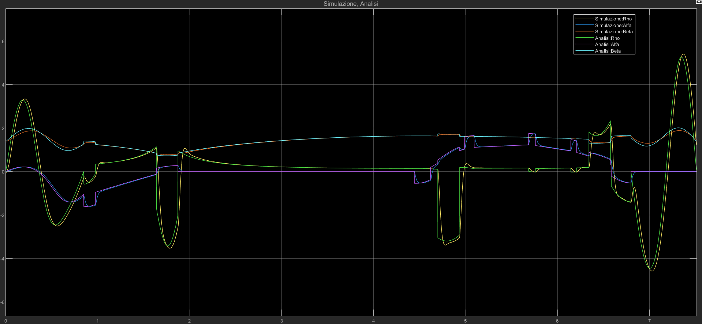

# Servosystems and Robotics Project - PRR Manipulator

## Introduction
This project involves the modeling, simulation, and control of an industrial manipulator as part of the Servosystems & Robotics course. The primary objective is to execute a complex trajectory approximating the letter "b" located on an inclined plane. The study covers the entire robotics pipeline, from kinematic modeling to dynamic control and simulation validation.

## Kinematic Analysis
The kinematic study includes both direct and inverse analysis at the position, velocity, and acceleration levels.
* **Direct Kinematics:** Computation of the end-effector position and orientation based on joint coordinates.
* **Inverse Kinematics:** Determination of joint variables required to reach a specific target in the workspace.
* **Singularity Analysis:** Identification of singular configurations where the manipulator loses degrees of freedom or requires infinite joint velocities.
* **Workspace:** Determination of the operational reach according to ISO 9946 standards.

| Coordinate System & Angles | DH Frames & Reference Systems |
| :---: | :---: |
|  |  |
| *Structural scheme with joint angles* | *Assignment of coordinate frames* |

## Dynamic Analysis
The inverse dynamic analysis evaluates the forces and torques required by the actuators to perform the assigned movement. This analysis accounts for the inertial properties, velocities, and accelerations of the manipulator links.

## Control Structure
A control architecture was designed to ensure the manipulator follows the prescribed trajectory while respecting motor limits.
* **Trajectory Planning:** The path uses a lines-parabolas algorithm for the letter "b" and a cycloidal acceleration profile for transitions.
* **Controller Choice:** Implementation of a decentralized or centralized controller (e.g., inverse dynamics or precomputed torques) to minimize the error between theoretical and simulated motion.

## Results and Simulation
The simulation verifies the continuity of position and velocity throughout the task.
* **Path Execution:** The manipulator moves from $P_1$ to $P_2$, traces the letter "b", and returns to $P_1$.
* **Validation:** Comparison between theoretical trajectories and simulated results to assess control effectiveness.
* **Data Visualization:** Graphs include joint coordinates, motor torques, and end-effector xyz trajectories versus time.

## Software
* MATLAB / Simulink / Simscape.
